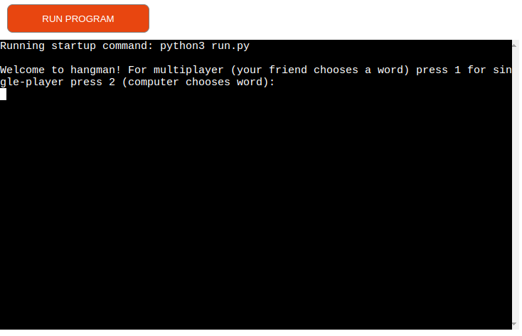

# Hangman game

# Hangman is a python3 terminal project that let the user or users play the game hangman.

## Program features

 * Program first let the user choose game mode, if the user write in 1 it's multiplayer game mode. if the input is not 1 or 2 validation is applied so the program will re ask for input until the input is 1 or 2. With multiplayer game mode the program then asks the user for a word for the other user to guess. The word have to be at least 3 chars and max 12 chars. Validation is applied if the user try to input less than 3 chars or more than 12 or if the word contains illegal non alphabetic charachters like 4 or ! etc.

 * If the user instead write in 2 the user chooses singleplayer game mode. In this game mode the computer will randomly choose a word for you. So when choosing this game mode the program then asks the user what difficultly the user want. If the user choose 1 the program will randomly choose a word from a file with easy words. If the user choose 2  the program will randomly choose a word from a file with hard words. 

 * When game mode is choosen the program will show the amount of chars the letter have by replaceing the letter with an underscore. Then the program will ask the user for to guess on letter at the time. Validation is applied that checks if the user input is a single letter and its alphabetic and that the letter have not already been guessed. If the guessed letter is not a part of the word to guess the program will count down the amount of guesses the user have that starts at 8. It will also visually show a hanged person with the correspondeing stages depending on what stage of the game the user are at. If the guessed letter is a part of the word to guess the progream will not count down the amount of guesses and it will reaveal the letters by replaceing the underscore with the letter/s. If the amount of guesses is 0 the program will reveal what the word was and the program ends.

## Deployment:

The project is deployed at the platform Heroku at the following link:

https://camillath-portfolio-3-hangman.herokuapp.com/

### clone repository locally (HTTPS)

* Navigate to the repository (https://github.com/CamillaTH/portfolio-3)
* Click on the button "code".
* Choose "HTTPS"
* Choose a local directory where want to clone the repository.
* Open terminal at the location you want the repository and write "git clone https://github.com/CamillaTH/portfolio-3.git" and press enter.
* SSH curently not supported since no public keys are added

To <b>run the program</b> click on the link above

## Dependencies:
 * python 3
### External dependencies: 
 * No external dependencies are required to run this program

### Libs:

Libs that are used : random

## Bugs:

There are no known bugs. But some bugs where discovered and fixed during development.

## Validation:

The program validates the user input and raises error if the user input is not legal.

## Testing:

### Test cases: 

#### Test Case 1: Single Player Mode easy, play again
##### Input:

* Select single single-player mode by entering 2.
* Select difficulty level by entering 1 for easy.
* select 1 when obtaining maximum allowed guesses

##### Expected Output:

* The program initializes with a word selected by the computer.
* The word should be from the "hangman_words_easy.txt" list
* The program prompts you to guess letters.
* After Obtaining the maximum allowed guesses, the program displays the correct word and asks if you want to play again
* Program restarts

#### Test Case 2: Single Player Mode hard, exit game 
##### Input:

* Select single single-player mode by entering 2.
* Select difficulty level by entering 2 for easy.
* select 2 when obtaining maximum allowed guesses

##### Expected Output:

* The program initializes with a word selected by the computer.
* The word should be from the "hangman_words_hard.txt" list
* The program prompts you to guess letters.
* After Obtaining the maximum allowed guesses, the program displays the correct word and asks if you want to play again
* Program exits

## Credits
* Inspiration taken from the classic game hangman that you often played in school on the whiteboard.
* hangman image was taken from [stock.adobe.com](https://www.istockphoto.com/)